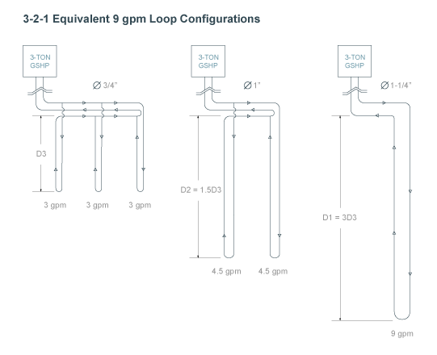

# Horizontally-Bored GHEX

Use this page to create a new horizontally-bored ground heat exchanger layout within the selected Zone Group. An unlimited number of GHEX designs are allowed, although only one may be active at a given time.

## Tab Navigation

At the top of the GHEX page are two tabs allowing you to navigate between the GHEX design parameters (default page) and the GHEX header.

*  View/Edit GHEX design parameters
*  View/Edit header.

## GHEX Name

* Name Name the GHEX currently being designed. An unlimited number of GHEX designs are allowed, although only one may be active at a given time.
* Year The analysis period to use in the GHEX model. **LoopLink PRO** will use this value to predict the temperature change of the soil resulting from imbalances between the amount of heat added to the ground in cooling mode and removed from the ground in heating mode. Values from 10-20 years are most common.
    * The recommended value for this field is 10 years.
	<li class="warning"><h3>WARNING</h3>
Use of excessive values in this field will result in extremely conservative estimates for the Year-N temperature penalty, thus increasing overall design lengths and system first cost. Keep in mind that this calculation assumes (1) the building load and annual equivalent FLRHs for the Zone Group are accurate without large margin of error and/or safety factor and (2) the building will be used in exactly the same manner every year for N-Years.
</li>

## Formation Details

* Deep Earth Temperature The temperature of the soil, which can be assumed to be constant starting at a depth of 20 feet below the surface down to about 200 feet below the surface.
    * Deep earth temperature varies with location and weather conditions but is typically assumed to be 1-2 degrees above the average air temperature for the project location.
* Formation Thermal Conductivity The thermal conductivity of the native soil at the project location, which is a measure of how fast heat moves through a material due to a temperature difference.
    * Formation thermal conductivity is dependent on soil or rock type, moisture content, and density.
    * For large systems (>25 tons), a formation thermal conductivity test (FTC test, in-situ test) is recommended to directly measure soil properties.
    * For smaller systems, soil properties may be estimated if knowledge of local soil conditions is available.
    * For detailed soil information by state and county, visit the [USDA Natural Resources Conservation Service website](http://soils.usda.gov/survey/printed_surveys "USDA Web Soil Survey").
* Formation Thermal Diffusivity The thermal diffusivity of the native soil. Soil diffusivity is dependent on soil type, moisture content, and density.
    * Thermal diffusivity is a measure of how fast heat moves relative to its heat storage capacity.
    * If a FTC test has not been performed, a good first estimate of formation thermal diffusivity is assuming it to be approximately 70% of the formation thermal conductivity value.

* The temperature of the soil in the top 20 ft. of the earth's surface varies with location, time of year, and depth.  Mean Soil Temperature, Annual Swing, and Offset Day are necessary inputs to predict the soil temperature at a given location, time of year, and length using the Kusudah-Achenbach equation:
	* Refer to the figure below to see how soil temperature in Chicago, IL varies with depth and time of year (according to the Kusudah-Achenbach model).
	* 

* Mean Soil Temperature The mean earth temperature in top 10 feet of soil at a given location.
    * This value will be similar to the average annual air temperature at the given location.
* Annual Swing The earth surface temperature annual swing above and below the mean soil temperature at a given location.
    * This value typically ranges from 10-20 in moderate climates and from 30-40 in extreme climates with large swings in air temperature from summer to winter.
* Offset Day The number of days after January 1 to the minimum earth surface temperature.
    * The minimum soil surface temperature typically occurs in 30-40 days from the start of the year.

	<h3>Additional Resource</h3>
	
For more information on soil properties (including reference tables), refer to Section 5.3.2.1 (Chapter 5, pages 59-62) in IGSHPA's <a href="http://www.geoconnectionsinc.com/bookstore/IGSHPA_rlc_manual.html" target="_blank">Ground Source Heat Pump Residential & Light Commercial Design and Installation Guide</a>

	<h3>Additional Resource</h3>
	
For more information on Formation Thermal Conductivity testing, refer to Chapter 34, pages 13-14 in the <a href="https://www.ashrae.org/resources--publications/handbook" target="_blank">ASHRAE HVAC Applications Handbook (2011)</a>.

	<h3>Additional Resource</h3>
	
For more information on Kusudah-Achenbach soil temperature definitions (including reference tables), refer to Section 5.3.2.1 (Chapter 5, pages 52-59) in IGSHPA's <a href="http://www.geoconnectionsinc.com/bookstore/IGSHPA_rlc_manual.html" target="_blank">Ground Source Heat Pump Residential & Light Commercial Design and Installation Guide</a>

## Borehole Definition

* Bore Diameter The diameter of the borehole being drilled for insertion of the GHEX piping.
    * Common borehole diameters range from 4&quot;-6&quot;, depending on drilling conditions and the size of the u-bend piping being utilized.
* Piping Material The piping material used in the active portion of the vertical GHEX.
    * HDPE and PEXa are the only piping materials formally accepted by the [IGSHPA Standards Committee](http://www.geoconnectionsinc.com/bookstore/IGSHPA_design_installation_standards.html "Geo-Connections Bookstore") for use in the buried portion of a GHEX piping system.
* Dimension Ratio (DR) The ratio of loop pipe outside diameter to its wall thickness.
    * Greater wall thickness (resulting in higher pipe pressure ratings) are associated with lower values of DR.
    * DR-11 HDPE (3408/3608) is the most commonly used u-bend piping, which has a 160 psi pressure rating at 73.4&deg;F.
    * DR-9 HDPE (3408/3608) has a 200 psi pressure rating at 73.4&deg;F.
    * Refer to Table A.1 in Chapter 3 of the [Second Edition Handbook of PE Pipe](http://plasticpipe.org/publications/pe_handbook.html "Plastic Pipe Institute") for more information on HDPE pipe pressure ratings.
* Nominal Size The u-bend pipe diameter to be used in the active section of the horizontally-bored GHEX.
    * **LoopLink PRO** will account for film resistance (a function of Reynold's number, which is determined by calculating gpm per loop, circulating fluid type, temperature and antifreeze concentration).
	* Design the GHEX to stay within the provided flow ranges (per parallel loop) in order to guarantee that parallel loop flow will be:
		1. Low enough to operate below the maximum recommended flow rate for head loss, which is  4 ft. H2O (per 100 ft.).
		2. High enough to operate with turbulent internal pipe flow through the parallel loop, which corresponds to a Reynold's number greater than 2,500.
	* Simply adjust the number of bores / parallel flow paths in the GHEX if the flow rate in each loop is above or below the optimum range.
	*	| Nominal Size  | Optimum Flow Range  |
		| :-----------: | :-----------------: |
		| 0.75&quot;    | 2.8 - 3.2 gpm       |
		| 1.00&quot;    | 4.0 - 6.0 gpm       |
		| 1.25&quot;    | 5.0 - 9.0 gpm       |
		| 1.50&quot;    | uncommon            |
		| 2.00&quot;    | uncommon            |
	* Refer to the figure below to view the correlation between u-bend pipe diameter, bore length, and gpm per flow path.
	* 
		
* Thermal Grout Conductivity The thermal conductivity of the grouting material to be placed into the borehole after insertion of the u-bend.
    * Thermal conductivity is a measure of how fast heat moves through a material due to a temperature difference.
	*	| Grout Type              | Conductivity Range                                |
		| :---------------------: | :-----------------------------------------------: |
		| non-thermally enhanced  | 0.38 - 0.45 Btu/hr-ft-&deg;F (0.65 - 0.78 W/m-K)  |
		| thermally enhanced      | 0.57 - 1.60 Btu/hr-ft-&deg;F (1.00 - 2.77 W/m-K)  |
	* Thermally enhanced grouting products typically require the addition of silica sand or graphite-based additives in the field in order to increase the thermal conductivity above 0.45 Btu/hr-ft-&deg;F (0.78 W/m-K).
	* Refer to **Bore Length as a Function of Grout TC** graph to see the effect of grout TC value on GHEX design lengths.
* Bore Length as a Function of Grout TC Click this button to view the calculated design lengths for the current GHEX layout at various Thermal Grout Conductivity values that are readily available from most thermal grout manufacturers.
	* This feature is not available until the ghex has been saved.
	

	<h3>Additional Resource</h3>
	
Refer to the <a href="http://geoproinc.com/resources/importance_of_grout_tc.html" target="_blank">Importance of Thermal Grout Conductivity</a> for further discussion on the effect that grout TC will have on design lengths as it relates to system economics.

## Circulating Fluid

* Circulating Fluid Selection Specify the fluid type and antifreeze concentration to be used (if applicable).
    * In general, freeze protection is recommended when heating mode EWTs will fall below 45&deg;F (7.2&deg;C).
* Antifreeze Concentration Slider When the selected circulating fluid type is propylene glycol, methanol or ethanol, the antifreeze concentration vs. freeze point temperature slider will appear. Choose the appropriate concentration based on the specified antifreeze type.
    * The recommended freeze point will be 10&deg;F below the average loop temperature under peak heating conditions.

## Loopfield Layout

* Rows The number of rows to be used in the horizontally-bored GHEX layout.
    * For example, a 10x2 loopfield layout would have 10 rows with 2 bores in each row for a total of 20 bores (rows x bores per row).
* Bores per Row The number of bores in each row to be used in the horizontally-bored GHEX layout.
    * The allowed range of values for Bores per Row is 1-3.
    * For example, a 10x2 loopfield layout would have 10 rows with 2 bores in each row for a total of 20 bores (rows x bores per row).
* CC Spacing Row The center-center spacing between rows. This value will affect the predicted temperature change of the soil resulting from imbalances between the amount of heat added to the ground in cooling mode and removed from the ground in heating mode.
    * **For systems with severe imbalances, values less than 20 ft. are not recommended**. 
* Cc Spacing Bore The center-center spacing between bores in a given row. You may specify a separate value in this field when the Cc Spacing Row and Cc Spacing Bore fields are un-linked.
    * **For systems with severe imbalances, values less than 20 ft. are not recommended**.
* Start Depth The target depth of the shallowest bore in a row.
    * For example, if horizontal bores are to be installed at depths of 15, 30, and 45 ft. below grade in each row, the start depth for this field would be 15 ft.
* Drilling Offset The amount of horizontal offset between bores in the same row.
    * For ease of installation, it is common for the drilling contractor to move over for each subsequent bore in a row rather than to stack all of the bores directly on top of one another.
    * A good value for drilling offset is **Cc Spacing Row / Bores per Row**.
    * For example, assuming a 15 ft. Cc Spacing Row and 3 Bores per Row, a typical offset value would be 15/3 = 5 ft. 
* Angle of Approach The angle at which the contractor will drill into the soil from the surface until the target depth is achieved.
    * **LoopLink PRO** will account for the portion of the loop that is installed above target depth. The most commonly used values are provided as selection choices.
    * For example, if a bore is installed 45 ft. below grade and the drilling entry angle is specified to be 3:1 (18.4 degrees), it will take a 135 ft. run for the drilling length to reach the target depth.
    
## Calculation Results

Calculation results are displayed in the left-hand output panel:

* Cooling mode calculation results are highlighted in **BLUE**.
* Heating mode calculations results are highlighted in **YELLOW**.
* Note that when an input is changed, the calculation results will not display on screen until the page is saved.

## Geometry

* Number of Bores The total number of bores in the GHEX, calculated to be **(Rows) x (Bores per Row)**.
* Y1 Length/Bore The length of each bore required to ensure the system will operate within designer-specified limits during the first year of system operation.
    * This parameter does not account for the long-term effects of ground load imbalances.
    * Outside of the inputs provided on the GHEX design page, **Y1 Length/Bore** is most sensitive to the peak loads and the minimum/maximum EWTs specified for the **Zone Group**.
    * Y1 Length/Bore will also be a function of the number of bores in the selected layout, calculated to be **(Y1 Total Length) / (Number of Bores)**.
* YN Length/Bore The length of each bore required to ensure the system will operate within designer-specified limits during the first **N-years** of system operation (as specified by user).
    * This parameter accounts for the long-term effects of ground load imbalances.
    * Outside of the inputs provided on the GHEX design page, **YN Length/Bore** is most sensitive to the peak loads, the minimum/maximum EWTs specified for the **Zone Group** and annual equivalent FLRHs.
    * **YN Length/Bore** will also be a function of the number of bores in the selected layout, calculated to be **(YN Total Length) / (Number of Bores)**.
* Design Length/Bore The greater of the **Y1 Length/Bore** and the **YN Length/Bore** for the dominant mode of operation.
    * This is the individual bore length to specify in the project design documents to ensure that the system will operate within designer-specified limits in both the short- and long-term.
* Y1 Total Length The total bore footage required in the specified configuration to ensure the system will operate within designer-specified limits during the first year of system operation.
    * This parameter does not account for the long-term effects of ground load imbalances.
    * Outside of the inputs provided on the GHEX design page, **Y1 Total Length** is most sensitive to the peak loads and the minimum/maximum EWTs specified for the **Zone Group**. 
* YN Total Length The total bore footage required in the specified configuration to ensure the system will operate within designer-specified limits during the first **N-years** of system operation (as specified by user).
    * This parameter accounts for the long-term effects of ground load imbalances. Outside of the inputs provided on the GHEX design page,
    * **YN Total Length** is most sensitive to the peak loads, the minimum/maximum EWTs specified for the **Zone Group** and annual equivalent FLRHs. 
* Total Design Length The greater of the **Y1 Total Length** and the **YN Total Length** for the dominant mode of operation.
    * This is the value to specify in the project design documents to ensure that the system will operate within specified limits in both the short- and long-term. 
* Avg Bore Depth The calculated average installation depth for the entire loopfield, which is a function of the **Number of Bores** as well as the specified **Cc Spacing Row**, **Cc Spacing Bore**, **Start Depth**, **Drilling Offset**, and **Angle of Approach** (if **Account for Entry** is selected).
* Avg CC Spacing The calculated average of center-center spacing for the entire loopfield, which is a function of the **Number of Bores** as well as the specified **Cc Spacing Row**, **Cc Spacing Bore**, **Drilling Offset**, and **Angle of Approach** (if **Account for Entry** is selected). 

## Thermal Resistance

* Grout Resistance The effective thermal resistance of the grouted cross-section of the borehole, which is a function of the size, spacing and configuration of the pipes in the borehole as well as the thermal conductivity of the grouting material placed in the annular space between the pipes and bore wall.
* Bore Resistance The effective thermal resistance of the completed borehole, which is the **grout resistance** in addition to the fluid film resistance (convection coefficient) and the pipe material resistance.
    * The fluid convection coefficient is a function of the fluid type, temperature and antifreeze concentration as well as the flow velocity through the pipe itself (Reynold's number).
    * Pipe resistance is a function of the piping material used as well as loop pipe diameter and wall thickness.   

## Ground Energy

* Space Conditioning The calculated amount of energy rejected to the ground in cooling mode and extracted from the ground in heating mode, which is a function of the peak loads, annual equivalent FLRHs and equipment efficiencies (EER/COP).
* Hot Water Generation The calculated amount of energy extracted from the ground due to hot water generation, which is a function of the peak hot water demand, annual hot water consumption and equipment heating efficiency (COP).
    * Hot water generation will add to the annual heating ground load, as indicated by the value only being shown in the **HEATING** column.
* Total The total cooling ground load due to space conditioning loads and the total heating ground load due to space conditioning load as well as hot water generation loads. 
* NET The difference between the cooling ground load and the heating ground load.
    * A negative value indicates that the annual ground load imbalance is **COOLING** dominant.
    * A positive value indicates that the annual ground load imbalance is **HEATING** dominant.

## Operating Conditions

* EWT The minimum/maximum entering water temperatures from the GHEX (supplied to the GHSP equipment) will be designed to provide under peak heating/cooling conditions, typically assumed to be 30&deg;F (-1.1 C) in heating-dominant applications and 90&deg;F (32.2 C) in cooling-dominant applications.
    * This parameter is specified on the **Zone Group** page and will have a very large impact on calculated design lengths.
* LWT The calculated minimum/maximum leaving water temperatures from the GSHP equipment (supplied to the GHEX) under peak heating/cooling conditions.
    * Leaving water temperatures are a function of the designer-specified EWTs, system flow and the heat of extraction/heat of rejection of the GSHP equipment specified for the **Zone Group**.
* System Flow The total system flow that the GHEX must accommodate.  This value will affect the calculations for LWT, loop flow, loop velocity, Reynold's number and head loss.
    * System flow is calculated based on the installed equipment capacity or peak block load and/or peak hot water generation demand for the system (depending on the **Flow Analysis Mode** specified for the **Zone Group**). 
* Y1 Temp. Penalty The temperature change of the soil after the first year of system operation.
    * This change results from imbalances between the amount of heat added to the ground in cooling and removed from the ground in heating and will reduce GHEX effectiveness over the long-term if unaccounted for.
    * The calculated temperature change accounts for thermal interference from adjacent bores, which is a function of the annual **NET** ground load as well as loopfield geometry (grid/layout and bore spacing). The designer is faced with selecting a layout and separation distance that is reasonable in order to minimize required land area without causing large increases in required bore length (due to temperature penalty).
    * A negative value indicates that the annual ground load imbalance is **COOLING** dominant.
    * A positive value indicates that the annual ground load imbalance is **HEATING** dominant.
* YN Temp. Penalty The temperature change of the soil after N-years of system operation. This change results from imbalances between the amount of heat added to the ground in cooling and removed from the ground in heating and will reduce GHEX effectiveness over the long-term if unaccounted for.
    * The calculated temperature change accounts for thermal interference from adjacent bores, which is a function of the annual **NET** ground load as well as loopfield geometry (grid/layout and bore spacing). The designer is faced with selecting a layout and separation distance that is reasonable in order to minimize required land area without causing large increases in required bore length (due to temperature penalty).
    * A negative value indicates that the annual ground load imbalance is **COOLING** dominant.
    * A positive value indicates that the annual ground load imbalance is **HEATING** dominant.
    <li class="warning"><h3>WARNING</h3>
Use of excessive values in the **Year** field will result in extremely conservative estimates for the Year-N temperature penalty, thus increasing overall design lengths and system first cost. Keep in mind that this calculation assumes (1) the building load and annual equivalent FLRHs for the Zone Group are accurate without large margin of error and/or safety factor and (2) the building will be used in exactly the same manner every year for N-Years.
</li> 

## Fluid Properties (Design Path)

* Freeze Protected To The freeze point temperature of the specified fluid, based on the fluid type and antifreeze concentration. In general, freeze protection is recommended when heating mode EWTs will fall below 45&deg;F (7.2 C).
    * The recommended freeze point will be 10&deg;F (5.6 C) below the average loop temperature under peak heating conditions.
* Flow The calculated flow through the individual parallel flow paths in the GHEX, which is a function of the system flow, total number of bores and the number of parallel loops per bore.
* Velocity The calculated velocity through the individual parallel flow paths in the GHEX, which is a function of the calculated parallel loop **Flow** as well as the selected loop pipe size.
* Reynold's Number A dimensionless parameter used to quantify the flow regime for internal pipe flow (laminar, transition, or turbulent).
    * The occurrence of turbulent flow will maximize heat transfer between the circulating fluid and internal pipe wall (commonly referred to as film resistance).
    * In practice, a Reynold's number greater than 2,500 is considered to correspond to turbulent flow.
    * Reynold's number is a function of the individual loop **Velocity** as well as the circulating fluid type, temperature and antifreeze concentration. 
* Head Loss/100 (ft) The calculated pressure drop (ft. of head loss per 100 ft. of pipe length) through the ground loop piping, which is a function of the individual loop **Velocity**, pipe surface roughness and the circulating fluid type, temperature and antifreeze concentration.
    * In general, values for head loss between 1-3 ft. H20 (per 100 ft.) are considered optimal.
    * The maximum recommended value is 4 ft. H20 (per 100 ft).
    * When loop head loss exceeds 4 ft. H2O (per 100 ft.), either increase the loop pipe size or add bores (to reduce parallel loop flow) in order to reduce head loss. 
