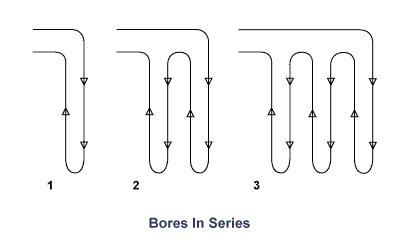

# VERTICALLY-BORED GHEX

Use this page to create a new vertically-bored ground heat exchanger layout within the selected Zone Group. An unlimited number of GHEX designs are allowed, although only one may be active at a given time.

## GHEX NAME

* **Name** Name the GHEX currently being designed. An unlimited number of GHEX designs are allowed, although only one may be active at a given time.
* **Year** The analysis period to use in the GHEX model. **LLPRO** will use this value to predict the temperature change of the soil resulting from imbalances between the amount of heat added to the ground in cooling mode and removed from the ground in heating mode. Values from 10-20 years are most common.
    * **WARNING** Use of excessive values in this field will result in extremely conservative estimates for the Year-N temperature penalty, thus increasing overall design lengths and system first cost. Keep in mind that this calculation assumes (1) the building load and annual equivalent FLRHs for the Zone Group are accurate without large margin of error and/or safety factor and (2) the building will be used in exactly the same manner every year for N-Years.
    * The recommended value for this field is 10 years.

## FORMATION DETAILS

* **Deep Earth Temperature** The temperature of the soil, which can be assumed to be constant starting at a depth of 20 feet below the surface down to about 200 feet below the surface.
    * Deep earth temperature varies with location and weather conditions but is typically assumed to be 1-2 degrees above the average air temperature for the project location.
* **Formation Thermal Conductivity** The thermal conductivity of the native soil at the project location, which is a measure of how fast heat moves through a material due to a temperature difference.
    * Formation thermal conductivity is dependent on soil or rock type, moisture content, and density.
    * For large systems (>25 tons), a formation thermal conductivity test (FTC test, in-situ test) is recommended to directly measure soil properties.
    * For smaller systems, soil properties may be estimated if knowledge of local soil conditions is available.
    * For detailed soil information by state and county, visit the [USDA Natural Resources Conservation Service website](http://soils.usda.gov/survey/printed_surveys "USDA Web Soil Survey").
* **Formation Thermal Diffusivity** The thermal diffusivity of the native soil.
    * Soil diffusivity is dependent on soil type, moisture content, and density.
    * Thermal diffusivity is a measure of how fast heat moves relative to its heat storage capacity.
    * If a FTC test has not been performed, a good first estimate of formation thermal diffusivity is assuming it to be approximately 70% of the formation thermal conductivity value.

*For more information on soil properties (including reference tables), refer to Section 5.2.2 (Chapter 5, pages 24-29) in IGSHPA's [Ground Source Heat Pump Residential & Light Commercial Design and Installation Guide](http://www.geoconnectionsinc.com/bookstore/IGSHPA_rlc_manual.html "Geo-Connections Bookstore").*

*For more information on Formation Thermal Conductivity testing, refer to Chapter 34, pages 13-14 in the [ASHRAE HVAC Applications Handbook (2011)](https://www.ashrae.org/resources--publications/handbook "ASHRAE Publications").*

## U-BEND CONFIGURATION

Borehole Thermal Resistance (BTR) is a function of the resistance of the piping material, the film resistance of the circulating fluid flowing through the system, the size and spacing of pipes in the borehole, the geometry of the borehole itself and the thermal conductivity of the grouting material placed in the borehole. The most common u-bend configurations are provided as choices for selection.  Custom values of BTR are also allowed.

* **Single U-Bend Equidistant ("B")** U-bend geometry described as having equal spacing between the loop pipes and the borehole wall itself. In order to achieve this configuration, loop piping must be mechanically centralized at 5 ft. increments during loop installation.
* **Single U-Bend Typical ("B/C")** U-bend geometry described as having average pipe placement between the "B" and the "C" configurations. Practical experience has shown that u-bend piping will naturally tend to resemble this configuration without additional means. 
* **Single U-Bend Spaced ("C")** U-bend geometry described as having each loop pipe touching the borehole wall at diametrically opposite points in the borehole. In order to achieve this configuration, loop piping must be mechanically spaced at 5 ft. increments during loop installation.
* **Double U-Bend in Series** U-bend geometry described as having two series-connected u-bends installed in a single bore. With this selection, two u-bends form one continuous flow path by being series-connected before returning to the header. **LLPRO** accounts for the increase in head loss due to the series arrangement of the loops (resulting in a greater run length for the pump to overcome).
* **Double U-Bend in Parallel** U-bend geometry described as having two parallel-connected u-bends installed in a single bore. With this selection, two u-bends form two separate flow paths by being individually connected to the header. **LLPRO** accounts for the decrease in Reynolds number due to the parallel arrangement of the loops (resulting in lower gpm in each loop, possibly eliminating turbulence).
* **Custom Bore Resistance** Use this selection to enter a custom BTR value. **WARNING:** Use custom BTR values at your own risk. BTR values are a function of the geometry of the proposed heat exchanger configuration as well as fluid film resistance, pipe wall resistance, grout resistance through the bore annulus, resistance of permanent casing and the location of the custom pipe configuration with respect to the bore wall.
    * **Custom BTR values should be confirmed through finite element analysis (FEA) modeling as well as empirical observation. Do not use custom BTR values that have not been corroborated via both methods.**

*For more information on BTR as it relates to u-bend placement/configuration in the borehole, refer to Chapter 2, pages 2-9 through 2-17 in [Grouting for Vertical GHP Systems](http://www.geoconnectionsinc.com/bookstore/grouting_for_vertical_ghp_systems.html "Geo-Connections Bookstore").*

## BOREHOLE DEFINITION

* **Uses Permanent Casing** Select this box if loopfield construction will be such that permanent casing will be left in the bore.  **LLPRO** will account for the effect of increased bore diameter in the cased portion of the bore as well as the effect of increased borehole thermal resistance when PVC casing is used.
* **Bore Diameter** The diameter of the borehole being drilled for insertion of the GHEX piping.
    * Common borehole diameters range from 4&quot;-6&quot;, depending on drilling conditions and the size of the u-bend piping being utilized.
* **Piping Material** The piping material used in the active portion of the vertical GHEX.
    * HDPE and PEXa are the only piping materials formally accepted by the [IGSHPA Standards Committee](http://www.geoconnectionsinc.com/bookstore/IGSHPA_design_installation_standards.html "Geo-Connections Bookstore") for use in the buried portion of a GHEX piping system.
* **Dimension Ratio (DR)** The ratio of loop pipe outside diameter to its wall thickness.
    * Greater wall thickness (resulting in higher pipe pressure ratings) are associated with lower values of DR.
    * DR-11 HDPE (3408/3608) is the most commonly used u-bend piping, which has a 160 psi pressure rating at 73.4&deg;F.
    * DR-9 HDPE (3408/3608) has a 200 psi pressure rating at 73.4&deg;F.
    * Refer to Table A.1 in Chapter 3 of the [Second Edition Handbook of PE Pipe](http://plasticpipe.org/publications/pe_handbook.html "Plastic Pipe Institute") for more information on HDPE pipe pressure ratings.
* **Nominal Size** The u-bend pipe diameter to be used in the active section of the vertically-bored GHEX.
    * **LLPRO** will account for film resistance (a function of Reynold's number, which is determined by calculating gpm per loop, circulating fluid type, temperature and antifreeze concentration).

**Refer to the figure below to view the correlation between u-bend pipe diameter, vertical bore depth, and gpm per flow path.**

* The target (optimum) flow rate versus pipe size is:  
    * 2.8 - 3.2 gpm per loop for 0.75&quot; loops
    * 4 - 6 gpm per loop for 1&quot; loops
    * 5 - 9 gpm per loop for 1.25&quot; loops
    * Use of 1.5" and 2" loops is uncommon
* Design the GHEX to stay within the provided flow ranges (per parallel loop) in order to guarantee that parallel loop flow will be:
    * Low enough to operate below the maximum recommended flow rate for head loss, which is  4 ft. H2O (per 100 ft.).
    * High enough to operate with turbulent internal pipe flow through the parallel loop, which corresponds to a Reynold's number greater than 2,500.
    * Simply adjust the number of bores / parallel flow paths in the GHEX if the flow rate in each loop is above or below the optimum range.

* **Grout Thermal Conductivity** The thermal conductivity of the grouting material to be placed into the borehole after insertion of the u-bend.
    * Thermal conductivity is a measure of how fast heat moves through a material due to a temperature difference.
    * Refer to **Bore Length as a Function of Grout TC** graph to see the effect of grout TC value on GHEX design lengths.
* **Bore Length as a Function of Grout TC** Click this button to view the calculated design lengths for the current GHEX layout at various grout thermal conductivity values that are readily available from most thermal grout manufacturers. 
* Grout thermal conductivity values typically range from:
    * 0.38 - 0.45 Btu/hr-ft-&deg;F (0.65 - 0.78 W/m-K) for non-thermally enhanced grouting products.
    * 0.57 - 1.60 Btu/hr-ft-&deg;F (1.00 - 2.77 W/m-K) for thermally enhanced grouting products.
* Thermally enhanced grouting products typically require the addition of silica sand or graphite-based additives in the field in order to increase the thermal conductivity above 0.45 Btu/hr-ft-&deg;F (0.78 W/m-K).
    * Refer to the [Importance of Grout Thermal Conductivity](http://geoproinc.com/resources/importance_of_grout_tc.html "GeoPro Document Library") for further discussion on the effect that grout TC will have on design lengths as it relates to system economics.

## CIRCULATING FLUID

* **Circulating Fluid Selection** Specify the fluid type and antifreeze concentration to be used (if applicable). In general, freeze protection is recommended when heating mode EWTs will fall below 45&deg;F (7.2 C).
* **Antifreeze Concentration Slider** When the selected circulating fluid type is propylene glycol, methanol or ethanol, the antifreeze concentration vs. freeze point temperature slider will appear. Choose the appropriate concentration based on the specified antifreeze type.
    * The recommended freeze point will be 10&deg;F (5.6 C) below the average loop temperature under peak heating conditions.

## LOOPFIELD LAYOUT

* **Rows** The number of rows to be used in the vertically-bored GHEX layout.
    * For example, a 2x10 rectangular loopfield layout would have 2 rows with 10 bores in each row for a total of 20 bores (rows x bores per row).
* **Bores per Row** The number of bores in each row to be used in the vertically-bored GHEX layout.
    * For example, a 2x10 rectangular loopfield layout would have 2 rows with 10 bores in each row for a total of 20 bores (rows x bores per row).
* **Bores in Series** The number of bores in series before the circuit is attached to the header.
    * Use a value of 1 for a basic parallel-type GHEX configuration.
    * Adjust the value when a series-parallel system is used.
    * A series-type GHEX configuration is not recommended.

**Refer to the figure below to view the difference between a system with 1-, 2-, and 3-bores-in-series.**

* **Stagger Rows** Select this box if a staggered field layout is to be used. This selection will modify the center-center bore spacing and associated temperature penalty calculations.
* **Cc Spacing Row** The center-center spacing between rows. This value will affect the predicted temperature change of the soil resulting from imbalances between the amount of heat added to the ground in cooling mode and removed from the ground in heating mode.
    * **For systems with severe imbalances, values less than 20 ft. are not recommended**. 
* **Cc Spacing Bore** The center-center spacing between bores in a given row.
    * You may specify a separate value in this field when the Cc Spacing Row and Cc Spacing Bore fields are un-linked.
    * **For systems with severe imbalances, values less than 20 ft. are not recommended**. 

## CALCULATION RESULTS

Calculation results are displayed in the left-hand output panel:

* Cooling mode calculation results are highlighted in **&nbsp;BLUE&nbsp;**.
* Heating mode calculations results are highlighted in **&nbsp;YELLOW&nbsp;**.
* Note that when an input is changed, the calculation results will not display on screen until the page is saved.

## GHEX PERFORMANCE
* **Grout Resistance** The effective thermal resistance of the grouted cross-section of the borehole, which is a function of the size, spacing and configuration of the pipes in the borehole as well as the thermal conductivity of the grouting material placed in the annular space between the pipes and bore wall.
* **Bore Resistance** The effective thermal resistance of the completed borehole, which is the **grout resistance** in addition to the fluid film resistance (convection coefficient) and the pipe material resistance.
    * The fluid convection coefficient is a function of the fluid type, temperature and antifreeze concentration as well as the flow velocity through the pipe itself (Reynold's number).
    * Pipe resistance is a function of the piping material used as well as loop pipe diameter and wall thickness.   

## GEOMETRY

* **Number of Bores** The total number of bores in the GHEX, calculated to be **(Rows) x (Bores per Row)**.

* **Y1 Length/Bore** The depth of each bore required to ensure the system will operate within designer-specified limits during the first year of system operation.
    * This parameter does not account for the long-term effects of ground load imbalances. Outside of the inputs provided on the GHEX design page,
    * **Y1 Length/Bore** is most sensitive to the peak loads and the minimum/maximum EWTs specified for the **Zone Group**.
    * **Y1 Length/Bore** will also be a function of the number of bores in the selected layout, calculated to be **(Y1 Total Length) / (Number of Bores)**.
* **YN Length/Bore** The depth of each bore required to ensure the system will operate within designer-specified limits during the first **N-years** of system operation (as specified by user).
    * This parameter accounts for the long-term effects of ground load imbalances. Outside of the inputs provided on the GHEX design page,
    * **YN Length/Bore** is most sensitive to the peak loads, the minimum/maximum EWTs specified for the **Zone Group** and annual equivalent FLRHs.
    * **YN Length/Bore** will also be a function of the number of bores in the selected layout, calculated to be **(YN Total Length) / (Number of Bores)**.
* **Design Length/Bore** The greater of the **Y1 Length/Bore** and the **YN Length/Bore** for the dominant mode of operation.
    * This is the individual bore depth to specify in the project design documents to ensure that the system will operate within designer-specified limits in both the short- and long-term.

* **Y1 Total Length** The total bore footage required in the specified configuration to ensure the system will operate within designer-specified limits during the first year of system operation.
    * This parameter does not account for the long-term effects of ground load imbalances.
    * Outside of the inputs provided on the GHEX design page, **Y1 Total Length** is most sensitive to the peak loads and the minimum/maximum EWTs specified for the **Zone Group**. 
* **YN Total Length** The total bore footage required in the specified configuration to ensure the system will operate within designer-specified limits during the first **N-years** of system operation (as specified by user).
    * This parameter accounts for the long-term effects of ground load imbalances.
    * Outside of the inputs provided on the GHEX design page, **YN Total Length** is most sensitive to the peak loads, the minimum/maximum EWTs specified for the **Zone Group** and annual equivalent FLRHs. 
* **Total Design Length** The greater of the **Y1 Total Length** and the **YN Total Length** for the dominant mode of operation.
    * This is the value to specify in the project design documents to ensure that the system will operate within specified limits in both the short- and long-term. 

* **Avg CC Spacing** The calculated average of center-center spacing for the entire loopfield, which is a function of the **Number of Bores** as well as the specified **Cc Spacing Row** and **Cc Spacing Bore**. 
* **Row CC Spacing** The center-center spacing between rows. This value will affect the predicted temperature change of the soil resulting from imbalances between the amount of heat added to the ground in cooling mode and removed from the ground in heating mode. **For systems with severe imbalances, values less than 20 ft. are not recommended**. 
* **Bore CC Spacing** The center-center spacing between bores in a given row.
    * You may specify a separate value in this field when the Cc Spacing Row and Cc Spacing Bore fields are un-linked.
    * **For systems with severe imbalances, values less than 20 ft. are not recommended**. 

## GROUND ENERGY

* **Space Conditioning** The calculated amount of energy rejected to the ground in cooling mode and extracted from the ground in heating mode, which is a function of the peak loads, annual equivalent FLRHs and equipment efficiencies (EER/COP).
* **Hot Water Generation** The calculated amount of energy extracted from the ground due to hot water generation, which is a function of the peak hot water demand, annual hot water consumption and equipment heating efficiency (COP).
    * Hot water generation will add to the annual heating ground load, as indicated by the value only being shown in the **&nbsp;HEATING&nbsp;** column.
* **Total** The total cooling ground load due to space conditioning loads and the total heating ground load due to space conditioning load as well as hot water generation loads. 
* **NET** The difference between the cooling ground load and the heating ground load.
    * A negative value indicates that the annual ground load imbalance is **&nbsp;COOLING&nbsp;** dominant.
    * A positive value indicates that the annual ground load imbalance is **&nbsp;HEATING&nbsp;** dominant.

## OPERATING CONDITIONS

* **EWT** The minimum/maximum entering water temperatures from the GHEX (supplied to the GHSP equipment) will be designed to provide under peak heating/cooling conditions, typically assumed to be 30&deg;F (-1.1 C) in heating-dominant applications and 90&deg;F (32.2 C) in cooling-dominant applications.
    * This parameter is specified on the **Zone Group** page and will have a very large impact on calculated design lengths.
* **LWT** The calculated minimum/maximum leaving water temperatures from the GSHP equipment (supplied to the GHEX) under peak heating/cooling conditions.
    * Leaving water temperatures are a function of the designer-specified EWTs, system flow and the heat of extraction/heat of rejection of the GSHP equipment specified for the **Zone Group**.

* **System Flow** The total system flow that the GHEX must accommodate.  This value will affect the calculations for LWT, loop flow, loop velocity, Reynold's number and head loss.
    * System flow is calculated based on the installed equipment capacity or peak block load and/or peak hot water generation demand for the system (depending on the **Flow Analysis Mode** specified for the **Zone Group**). 

* **Y1 Temp. Penalty** The temperature change of the soil after the first year of system operation.
    * This change results from imbalances between the amount of heat added to the ground in cooling and removed from the ground in heating and will reduce GHEX effectiveness over the long-term if unaccounted for.
    * The calculated temperature change accounts for thermal interference from adjacent bores, which is a function of the annual **NET** ground load as well as loopfield geometry (grid/layout and bore spacing). The designer is faced with selecting a layout and separation distance that is reasonable in order to minimize required land area without causing large increases in required bore length (due to temperature penalty).
    * A negative value indicates that the annual ground load imbalance is **&nbsp;COOLING&nbsp;** dominant.
    * A positive value indicates that the annual ground load imbalance is **&nbsp;HEATING&nbsp;** dominant.
* **YN Temp. Penalty** The temperature change of the soil after N-years of system operation.
    * This change results from imbalances between the amount of heat added to the ground in cooling and removed from the ground in heating and will reduce GHEX effectiveness over the long-term if unaccounted for.
    * The calculated temperature change accounts for thermal interference from adjacent bores, which is a function of the annual **NET** ground load as well as loopfield geometry (grid/layout and bore spacing).
    * The designer is faced with selecting a layout and separation distance that is reasonable in order to minimize required land area without causing large increases in required bore length (due to temperature penalty).
    * A negative value indicates that the annual ground load imbalance is **&nbsp;COOLING&nbsp;** dominant.
    * A positive value indicates that the annual ground load imbalance is **&nbsp;HEATING&nbsp;** dominant.

**WARNING** Use of excessive values in the **Year** field will result in extremely conservative estimates for the Year-N temperature penalty, thus increasing overall design lengths and system first cost. Keep in mind that this calculation assumes (1) the building load and annual equivalent FLRHs for the Zone Group are accurate without large margin of error and/or safety factor and (2) the building will be used in exactly the same manner every year for N-Years. 

## FLUID PROPERTIES (DESIGN PATH)

* **Freeze Protected To** The freeze point temperature of the specified fluid, based on the fluid type and antifreeze concentration. In general, freeze protection is recommended when heating mode EWTs will fall below 45&deg;F (7.2 C). The recommended freeze point will be 10&deg;F (5.6 C) below the average loop temperature under peak heating conditions.

* **Flow** The calculated flow through the individual parallel flow paths in the GHEX, which is a function of the system flow, total number of bores and the number of parallel loops per bore.
* **Velocity** The calculated velocity through the individual parallel flow paths in the GHEX, which is a function of the calculated parallel loop **Flow** as well as the selected loop pipe size.

* **Reynold's Number** A dimensionless parameter used to quantify the flow regime for internal pipe flow (laminar, transition, or turbulent).
    * The occurrence of turbulent flow will maximize heat transfer between the circulating fluid and internal pipe wall (commonly referred to as film resistance).
    * In practice, a Reynold's number greater than 2,500 is considered to correspond to turbulent flow.
    * Reynold's number is a function of the individual loop **Velocity** as well as the circulating fluid type, temperature and antifreeze concentration. 

* **Head Loss/100 (ft)** The calculated pressure drop (ft. of head loss per 100 ft. of pipe length) through the ground loop piping, which is a function of the individual loop **Velocity**, pipe surface roughness and the circulating fluid type, temperature and antifreeze concentration.
    * In general, values for head loss between 1-3 ft. H20 (per 100 ft.) are considered optimal.
    * The maximum recommended value is 4 ft. H20 (per 100 ft).
    * When loop head loss exceeds 4 ft. H2O (per 100 ft.), either increase the loop pipe size or add bores (to reduce parallel loop flow) in order to reduce head loss. 